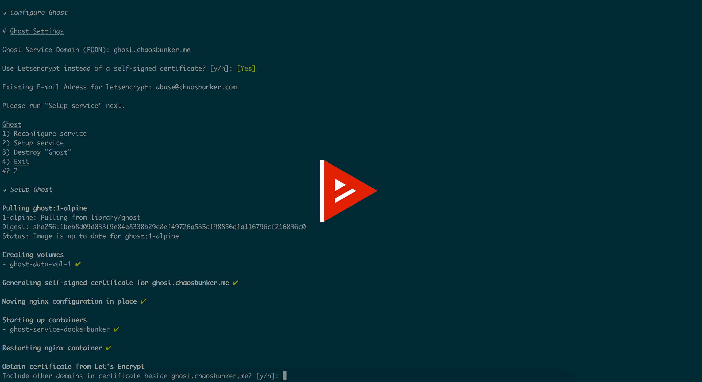

# What is dockerbunker

`dockerbunker` is a tool that helps configure, deploy and manage dockerized web-applications or static sites behind an nginx reverse proxy. Apps can easily be fully backed up or restored from a previous backup. The only requirement is docker.

[](https://asciinema.org/a/PGkj249ZRCtYKKSmpgqymBWmh)

#### Currently included:

| A - G        | H - O           | P - Z  |
| :-------------: |:-------------:| :-----:|
|[Bitbucket](https://www.atlassian.com/software/bitbucket)|[Hastebin](https://hastebin.com/about.md)|[Padlock Cloud](https://github.com/padlock/padlock-cloud)|
|[cryptpad](https://cryptpad.fr/)|[IPsec VPN Server](https://github.com/hwdsl2/docker-ipsec-vpn-server)|[Piwik](https://github.com/piwik/piwik)|
|[CS50 IDE](https://manual.cs50.net/ide/offline)|[json-server](https://github.com/typicode/json-server)|[Seafile Pro](https://github.com/haiwen/seafile)|
|[Dillinger](https://dillinger.io/)|[Kanboard](https://kanboard.net/)| [Searx](https://github.com/asciimoo/searx.git)|
|[Ghost Blog](https://ghost.org/)|[Mailcow Dockerized](https://github.com/mailcow/mailcow-dockerized)|[Mozilla send](https://send.firefox.com/)|
|[Gitea](https://gitea.io/en-us/)|[Mailpile](https://www.mailpile.is/)|[sFTP Server](https://github.com/atmoz/sftp)|
|[Gitlab CE](https://gitlab.com/)|[Mastodon](https://github.com/tootsuite/mastodon) (+ [Glitch Edition](https://github.com/glitch-soc/mastodon))|[Wekan](https://wekan.github.io/)
|[Gogs](https://gogs.io/)|[Nextcloud](https://github.com/nextcloud/docker)|[Wordpress](https://wordpress.org/)
||[Open Project](https://www.openproject.org/)||

## How to get started:

1. Get docker

    - Most systems can install Docker by running `wget -qO- https://get.docker.com/ | sh`

3. Clone the master branch of this repository and run `./dockerbunker.sh`

    - `git clone https://github.com/chaosbunker/dockerbunker.git && cd dockerbunker`
	- `./dockerbunker.sh`

4. Select a service and configure it (Set domain, etc..)

5. Set up the service. This will
	- Create an internal network if necessary
	- Create volumes
	- Pull or buld images
	- Run containers
	- Obtain certificate from Let's Encrypt (if chosen during config)

That's it.

Now when selecting the same service again in the dockerbunker menu, there will be more options depending on the current state of the service. For example:
```
Nextcloud
1) Reconfigure service
2) Reinstall service
3) Obtain Let's Encrypt certificate (<-- only visible if using self-signed cert)
4) Restart container(s)
5) Stop container(s) (<- only visible when containers are running, otherwise offers "Start Containers"
6) Backup Service
7) Restore Service (<- only visible if backup(s) for service are found)
8) Upgrade Image(s)
9) Destroy "Nextcloud"
```

When destroying a service everything related to the service will be removed. Only Let's Encrypt certificates will be retained.

### SSL

When configuring a service, a self-signed certificate is generated and stored in `data/conf/nginx/ssl/${SERVICE_HOSTNAME}`. Please move your own trusted certificate and key in that directory as `cert.pem` and `key.pem` after configuration of the service is complete.

If you choose to use [Let's Encrypt](https://letsencrypt.org/) during setup, certificates will be automatically obtained via a Certbot container. Let's Encrypt data is stored in `data/conf/nginx/ssl/letsencrypt`.

It is possible to add additional domains to the certificate before obtaining the certificate and these domains will also automatically be added to the corresponding nginx configuration.

#### Backup & Restore

When backing up a service, a timestamped directory will be created in `data/backup/${SERVICE_NAME}`. The following things will get backed up into (or restored from) that directory: 

- All volumes (will be compressed)
- nginx configuration if service is accessible via web (from data/conf/nginx/conf.d/${SERVICE_DOMAIN})
- other user-specific configuration files (from data/conf/${SERVICE_NAME})
- environment file(s) (from data/env/${SERVICE_NAME}*)
- ssl certificate" (from data/conf/nginx/ssl/${SERVICE_DOMAIN} and, if applicable data/conf/nginx/ssl/letsencrypt)

#### Good to know:
All credentials that are set by the user or that are automatically generated are stored in data/env/${SERVICE_NAME}.env.

Please refer to the documentation of each web-app (regarding default credentials, configuration etc.)

#### Why I made this

I know that it is not really ideal and recommended to do something like this with bash alone. `dockerbunker` is an idea that went a bit out of control. It was inspired by [@DFabric's](https://github.com/DFabric/) [DPlatform-DockerShip](https://github.com/DFabric/DPlatform-DockerShip). You can read more about why I made dockerbunker [here](https://chaosbunker.com/projects/tech/dockerbunker) (tl;dr: I enjoyed the process)
